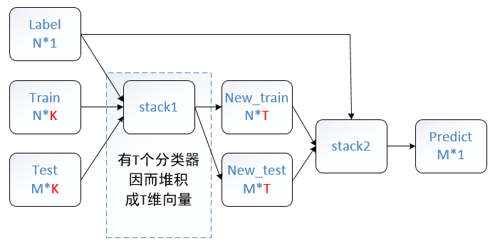

# python数据挖掘包集合
基础包：numpy,scipy
大神级数据挖掘包：sklearn
数据可视化：pandas
数据不均衡：imbalanced-learn
大神级nlp包：gensim（word2vec和LDA）
深度学习包：TensorFlow

scikit-learn. 涵盖了基本能想到的各种机器学习算法，由于本人python党，我把它当作matlab和R的替代品。
xgboost. 华盛顿大学机器学习大牛陈天奇出品的GBRT框架，果然是刷比赛利器。
liblinear/libsvm. 台大林智仁团队的佳作，工业界很多也在用。
pandas. 处理数据python包，DataFrame那叫一个好用。
推荐系统库：python recsys

# python recsys

# 比赛套路
1. 读懂比赛介绍，明确是哪类问题:分类/排序/回归。
2. 数据特征处理。这个是最耗时也是最重要的，正所谓“数据和特征决定了效果上限，模型和算法决定了逼近这个上限的程度”。其实这点我还有很大欠缺，汗！
3. Cross validation数据集切分。数据集很大完全可以hold out一份作为测试集（不是待提交结果的测试集，此处是用来CV的），数据集偏小就需要K-fold或者Leave-one-out了，如果训练集有时序关系，还要注意测试集选取最后时间片的。这点我自我批评，有时为了省事，直接就提交结果做CV了。咳咳，这有点像imagenet比赛作弊了，只是我没用小号增加提交次数。
4. 常用算法/默认参数跑结果作为baseline。这个需要一些经验和直觉，一般来说Tree Based的Random Forest和GBRT效果都不会太烂，如果特征维度很大很稀疏这时就需要试试线性SVM和LR了。
5. 接下来就是调参了，这个我也没用太多经验，一般就是GridSearchCV或者RandomizedSearchCV。有人推荐Hyperopt库，接下来调研下。
迭代。为了取得比较好的结果，下面就是2/3/4/5不断迭代了。
6. Blending.上面说的都是单模型，最后让你结果更general/low variance，提升一个档次的就是结果ensemble了（不是指gbrt/rf的ensemble，是多种模型的融合）。这里我一般就是简单的多种模型结果的averaging（weighted）or voting，这里推荐一篇ensemble selection paper(http://www.cs.cornell.edu/~alexn/papers/shotgun.icml04.revised.rev2.pdf)。

source:[Kaggle实战(一)](http://nanjunxiao.github.io/2015/07/30/Kaggle%E5%AE%9E%E6%88%98%E4%B8%80/)

# SVG 奇异值分解

# Stacking

[Ensemble_learning 集成学习算法 stacking 算法](http://www.cnblogs.com/zhizhan/p/5051881.html)

相比较来看，Stacking集成最大的特点是灵活，我们可以设置多层级的Stack，每层可以设置合适的分类器簇，并且可以将新特征很方便的融合在层之间的中间结果里。

Stacking，直译：堆积。简言之，经典的Stacking框架分为2层，第一层含有T个分类器，产生T组与原数据集规模相同且维度为1的结果，将这T组结果拼在一起可组成新的数据集，用以构成第二层的输入。这样说很抽象，请看下图：

stacking框架强大的地方在于我们可以在第一层中选择许多不同的分类器，而且在第二层中还可以根据具体问题添加特征（word2vec特征就是在这里融合的），甚至还可以把整个框架扩展为3层或更多，我们试过3层的效果并不理想。我们最终方案中，第一层有25个模型（从sklearn中选择了几种不同的分类器，每种分类器设置几种不同的参数），第二层只有一个SVM。